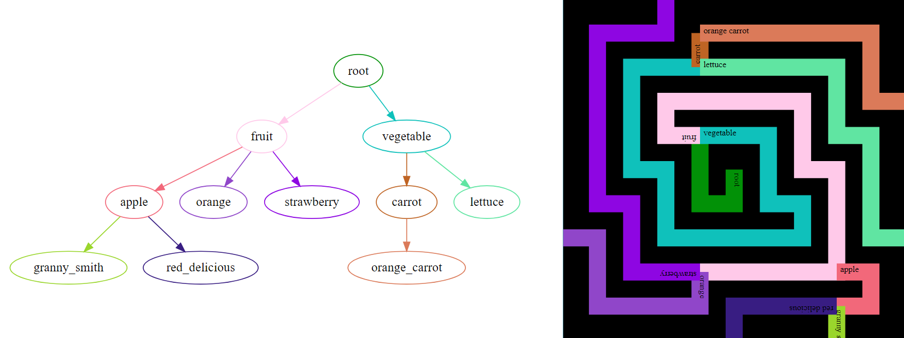

# tree2maze

This is a Python tool to transform a tree into a maze. Because why not!



## Installation

This requires Python3 and the following libraries: svgwrite and randomcolor.

```
pip install svgwrite randomcolor
```

## Usage

It expects an input of a tree file formatted as a TSV. The first column is the name of the parent node and the second column to a comma-delimited list of the child nodes. e.g.

```
root	fruit,vegetable
fruit	apple,orange,strawberry
vegetable	carrot,lettuce
apple	granny smith,red delicious
carrot	orange carrot
```

Then usage is below:

```
python tree2maze.py --tree example_tree.tsv --outSVG example_maze.svg
```

All parameters are:

```
  --debug               Add some debug information
  --seed SEED           Seed for randomness
  --clockwiseProb CLOCKWISEPROB
                        Chance of the spiral going clockwise at each layer
                        (0.0-1.0)
  --extendProb EXTENDPROB
                        Chance of just extending a path without ending (0.0-1.0)
  --textmode TEXTMODE   Whether to display the path name along the path
                        (path), simply at the start (simple) or not at all
                        (none)
  --tree TREE           Tab delimited file with source node name as first
                        column and destination nodes (comma-delimited) as
                        second column
  --outSVG OUTSVG       SVG output of maze representation
  --outDot OUTDOT       DOT output of tree
  --minLayers MINLAYERS
                        Whether to put a lower-limit on the number of layers,
                        or just wait until tree has been fully realised
  --maxLayers MAXLAYERS
                        Whether to put an upper-limit on the number of layers,
                        or just wait until tree has been fully realised
```


